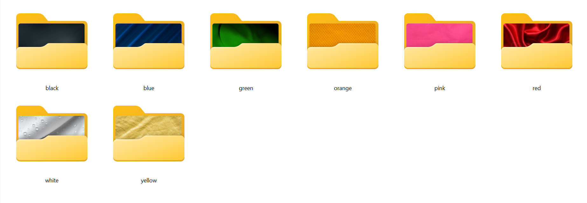
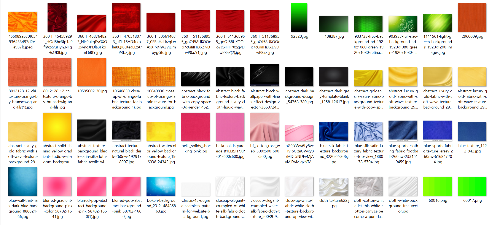
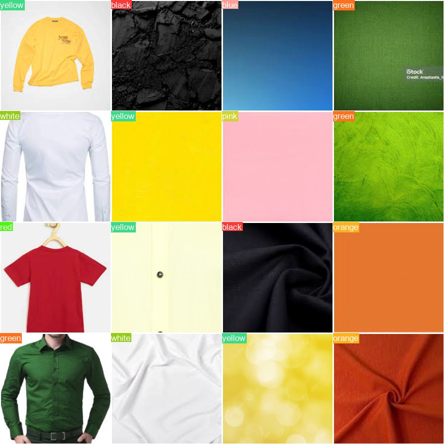
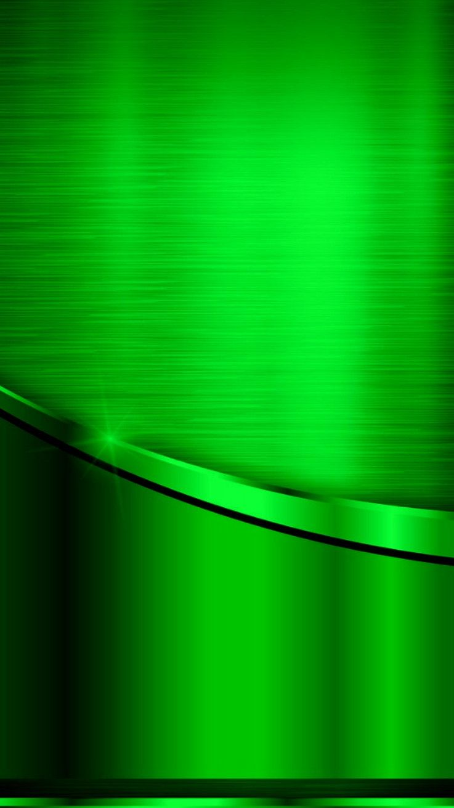
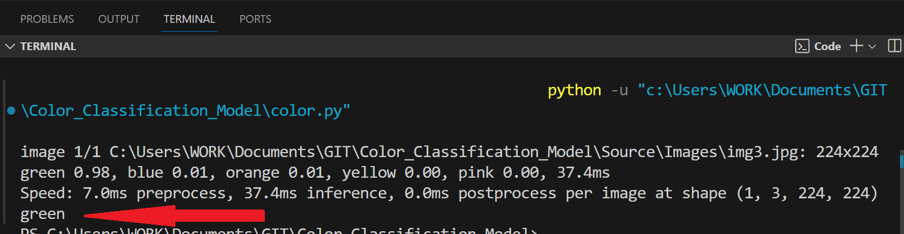

# 🎨 Color Classification Model Using YOLOv8

This project classifies the **dominant color** in an image using a **YOLOv8-based deep learning model**.  
It is designed to work **independently** or in combination with **object detection models**, allowing the detected object to be color-labeled (e.g., red car, blue bag).

The model doesn't use bounding boxes — it's a **single-label color classifier** that predicts the overall color from the image or a cropped region of interest.

---

## 🔗 Live Colab Demo

📌 [Click here to open the project in Colab](https://colab.research.google.com/drive/1gIdj6CAkbitMw4W5Q9YXPPh3-fhR0Oi3?usp=sharing)

> ⚠️ Note: This model takes **image input** and returns a **color label** as output.  
> For real-time object color detection, integrate it with an object detector.

---

## 🧪 Built With

| **Package** | **Version** |
| ----------- | ----------- |
| Python      | 3.8+        |
| OpenCV      | 4.8.1       |
| YOLOv8      | 8.0.2       |
| PyTorch     | 2.1.2       |
| pyttsx4     | 2.90        |

---

## 📁 Project Structure

```bash
📦 Color_Classification_Model
├── Source/
│   ├── Models/         # YOLOv8 trained model
│   └── Images/         # Sample images (input/output)
├── Color-Predict.ipynb  
├── requirements.txt
└── README.md
```

## 🖼️ Visual Examples

### Training Labels


### Training Data Samples


### Training Results


### Sample Input Image


### Predicted Color Output



## 🚀 Run Locally

### 📦 Download Source Files (Google Drive)

```bash
# Clone the repository
git clone https://github.com/sonir746/Color_Classification_Model.git
cd Color_Classification_Model

# Install dependencies
pip install -r requirements.txt

```

## 📢 How It Works

- You pass an image path to the model.

- YOLOv8 extracts features and classifies the dominant color.

- The predicted color is printed and spoken aloud using text-to-speech.

Use cases:

- Detecting the color of objects after object detection (e.g., red bottle, green bag)

- Assisting color-blind users

- Supporting accessibility in image interpretation


## 👤 Author
RAHUL SONI


## 🛠️ Feedback or Issues
Found a bug or have an idea to improve it?

📧 Email: rahulsoni7469@gmail.com

🐞 [Open an issue on GitHub](https://github.com/sonir746/Color_Classification_Model/issues)


